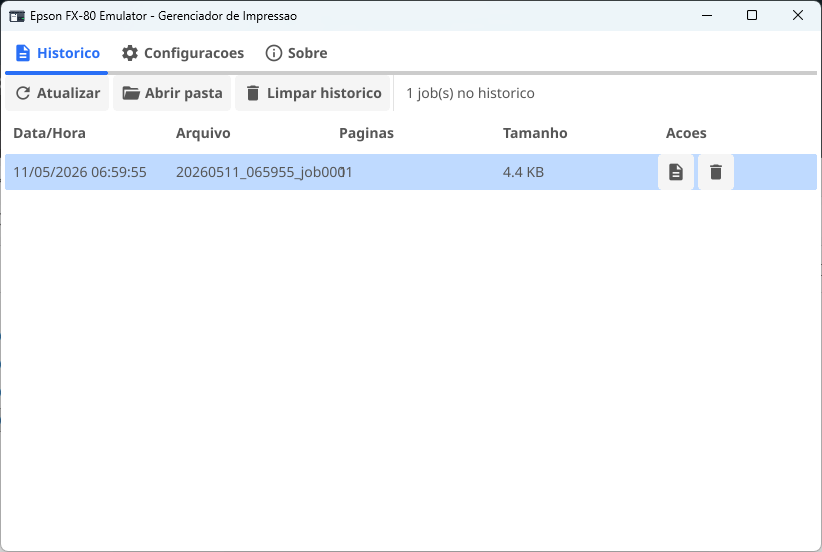
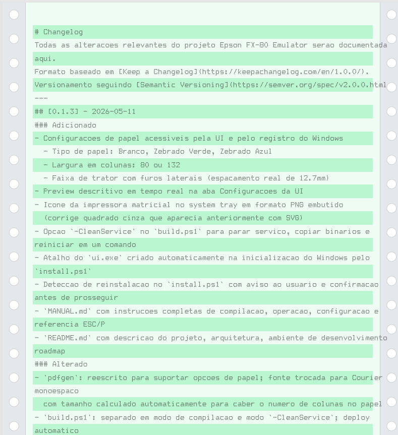

# Epson FX-80 Emulator

Emulador de impressora matricial Epson FX-80 para Windows. Versao atual: **0.1.5**

O projeto cria uma impressora virtual no Windows que qualquer aplicativo pode usar
normalmente -- o sistema operacional a enxerga como uma impressora real. Os dados
de impressao sao interceptados, processados e convertidos em arquivos PDF que
reproduzem a estetica dos documentos da epoca: papel zebrado, furos de trator,
fonte monoespaco e layout de 80 ou 132 colunas. Fontes TTF personalizadas podem
ser configuradas por modo de impressao (Regular, Bold, Italic, Condensed, Expanded
e todas as combinacoes).

---



---

## Objetivo

Emular 100% o comportamento de uma impressora matricial Epson FX-80, incluindo:

- Recepcao de jobs de impressao de qualquer aplicativo Windows
- Interpretacao de comandos ESC/P (linguagem de controle da Epson FX-80)
- Geracao de PDFs fieis ao visual da epoca
- Suporte a papel continuo com furos de trator
- Suporte a papel zebrado verde ou azul (faixas alternadas por linha)
- Suporte a 80 e 132 colunas
- Fontes TTF configuradas por modo de impressao (Regular, Bold, Italic, Condensed, Expanded e combinacoes)
- Interface de gerenciamento com historico de jobs e pagina de teste

> **Trabalho em curso.** A interpretacao completa do conjunto de comandos ESC/P da
> FX-80 ainda esta sendo implementada. O estado atual processa texto simples com
> limpeza basica de sequencias de escape. A emulacao grafica completa sera
> adicionada progressivamente.

---

## Como funciona

```
[Qualquer aplicativo Windows]
        |
        |  API de impressao do Windows
        v
[Driver: Generic / Text Only]
        |
        |  Porta: \\.\pipe\epson_fx80_emulator
        v
[portmonitor.exe  --  servico Windows]
        |
        |-- Le os dados brutos do job
        |-- Limpa sequencias de escape ESC/P
        |-- Aplica configuracoes de papel e fontes TTF
        v
[pdfgen  --  gerador de PDF]
        |
        |-- Fonte TTF por modo (ou Courier como fallback)
        |-- Zebrado por linha (verde ou azul)
        |-- Faixa de trator com furos laterais
        |-- 80 ou 132 colunas
        v
[PDF salvo em Documentos\EpsonFX80\]
        |
        v
[ui.exe  --  bandeja do sistema]
        |-- Historico de jobs (SQLite)
        |-- Abre PDFs gerados
        |-- Configura papel, colunas, trator e fontes TTF por modo
        |-- Pagina de teste com todas as fontes configuradas
        |-- Monitora o servico portmonitor
```

O driver nao e um driver kernel-mode customizado. Usamos o driver
"Generic / Text Only" ja presente no Windows e redirecionamos a porta de impressao
para um named pipe (`\\.\pipe\epson_fx80_emulator`). O portmonitor.exe escuta
esse pipe como servico Windows e processa cada job recebido.

---

## Estrutura do projeto

```
epson-fx80-emulator/
    go.mod                      modulo Go e dependencias
    build.ps1                   script de compilacao e deploy
    README.md                   este arquivo
    MANUAL.md                   instrucoes completas de operacao
    OUTLINE.md                  contexto tecnico para continuidade do desenvolvimento
    CHANGELOG.md                historico de versoes
    REFERENCE.md                referencia rapida de comandos operacionais

    installer/
        install.ps1             instala/desinstala a impressora no Windows
        main.go                 versao Go do installer
        fonts/ttf/              fontes TTF por modo de impressao
            regular/
            bold/
            italic/
            condensed/
            expanded/
            bold-italic/
            condensed-bold/
            condensed-italic/
            expanded-bold/
            expanded-italic/
            expanded-bold-italic/
            condensed-bold-italic/

    portmonitor/
        main.go                 entry point do servico; pre-carga fontes TTF
        service.go              interface com o SCM do Windows
        monitor.go              loop do named pipe
        processor.go            orquestra leitura, conversao e armazenamento

    pdfgen/
        pdfgen.go               converte texto em PDF com opcoes de papel e fontes
        options.go              le configuracoes do registro do Windows
        testpage.go             gerador dedicado da pagina de teste

    storage/
        storage.go              banco SQLite com historico de jobs

    fontmgr/
        fontmgr.go              descobre TTFs, gerencia mapeamento modo->arquivo

    ui/
        main.go                 entry point da UI e system tray
        window.go               janela principal (historico + configuracoes)
        config.go               leitura e escrita de config no registro
        icon.go                 icone PNG embutido (impressora matricial)
        version.go              versao e build stamp injetados via ldflags
        testpage.go             gera e abre a pagina de teste
```

---

## Ambiente de desenvolvimento

| Item | Detalhe |
|---|---|
| Linguagem | Go 1.22 |
| IDE | GoLand (JetBrains) |
| Sistema operacional | Windows 10 / 11 (x64) |
| Scripts | PowerShell 5+ |
| UI | Fyne v2.4.5 |
| PDF | go-pdf/fpdf v0.9.0 |
| Banco de dados | SQLite via mattn/go-sqlite3 v1.14.22 |
| Named pipe | Microsoft/go-winio v0.6.2 |
| Suporte de IA | Claude (Anthropic) |

> O pacote `go-sqlite3` requer CGo. E necessario ter GCC instalado para compilar.
> Recomendado: [TDM-GCC](https://jmeubank.github.io/tdm-gcc/) para Windows.

---

## Compilacao

```powershell
# Na raiz do projeto
go mod tidy
.\build.ps1
```

O `build.ps1` compila os tres binarios em `dist\` e injeta versao e build stamp:

| Binario | Funcao |
|---|---|
| `portmonitor.exe` | Servico Windows que intercepta os jobs |
| `installer.exe` | Instala/desinstala a impressora (alternativa ao .ps1) |
| `ui.exe` | Interface grafica na bandeja do sistema |

Para atualizar o servico em producao sem reiniciar manualmente:

```powershell
.\build.ps1 -CleanService
```

Isso para o servico, encerra o ui.exe, copia os novos binarios para `installer\`
e reinicia tudo automaticamente.

---

## Instalacao

```powershell
# PowerShell como Administrador
cd installer
.\install.ps1
```

O script realiza:

1. Verifica o driver `Generic / Text Only` no Windows
2. Cria o diretorio `Documentos\EpsonFX80` para os PDFs
3. Registra a porta `\\.\pipe\epson_fx80_emulator`
4. Adiciona a impressora `Epson FX-80 Emulator` no Windows
5. Grava configuracoes em `HKLM\SOFTWARE\EpsonFX80Emulator`
6. Instala e inicia o servico `EpsonFX80Monitor`
7. Cria atalho do `ui.exe` na inicializacao do Windows

```powershell
.\install.ps1 -Uninstall   # desinstala
.\install.ps1 -Status      # verifica estado atual
```

---

## Configuracoes

Acessiveis pelo icone na bandeja > Abrir gerenciador > Configuracoes:

| Opcao | Valores |
|---|---|
| Tipo de papel | Branco / Zebrado Verde / Zebrado Azul |
| Largura | 80 colunas / 132 colunas |
| Faixa de trator | Com furos laterais / Sem |
| Pasta de saida | Qualquer diretorio local |
| Fontes TTF | Um arquivo .ttf por modo de impressao |

As configuracoes sao salvas no registro do Windows e aplicadas a partir do proximo job.



---

## Diagnostico

```powershell
sc query EpsonFX80Monitor                          # status do servico
Get-Content .\installer\portmonitor.log -Tail 30  # ultimas linhas do log
.\install.ps1 -Status                              # status geral
```

---

## Roadmap

- [x] Instalacao da impressora virtual no Windows
- [x] Interceptacao de jobs via named pipe
- [x] Geracao de PDF com fonte monoespaco (Courier)
- [x] Papel zebrado (verde e azul) por linha
- [x] Faixa de trator com furos laterais
- [x] Suporte a 80 e 132 colunas
- [x] Historico de jobs em SQLite
- [x] Interface grafica com system tray
- [x] Configuracoes persistentes no registro
- [x] Versao e build stamp injetados em tempo de compilacao
- [x] Fontes TTF configuradas por modo de impressao
- [x] Pagina de teste com todas as fontes configuradas
- [ ] Interpretacao completa do conjunto ESC/P da FX-80
- [ ] Modo condensado (17 cpi) e expandido (5 cpi) via ESC
- [ ] Negrito, italico e sublinhado via sequencias ESC
- [ ] Graficos de pinos (bit image graphics)
- [ ] Suporte a codepages internacionais
- [ ] Preview do PDF antes de salvar
- [ ] Notificacao na bandeja ao receber novo job
